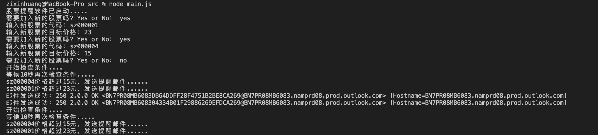

# stock-notify

## Purpose
Automatically notify user if current stock price is within certain conditions e.x. exceed certain price.
- support Hotmail and Chinese stock only

## Set up
- Download all npm packages using `npm install`
- Create an .env file and put it in ./src folder. Fill in 2 values below:
```
EMAILNAME = 
EMAILPASSWORD = 
```

## RUN
@ root folder `npm run server` 
sample console results:
